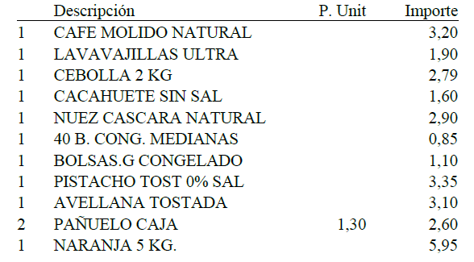

```{r setup, include=FALSE}
knitr::opts_chunk$set(echo = TRUE)
```

## 1.Librerias

Conjunto de librerías a utilizar:

```{r results='hide'}
library(pdftools)
library(tidyr)
library(dplyr)
library(ggplot2)
library(stringr)
library(lubridate)
```

## 2. Carga Pdfs

Los tickets que queremos analizar se encuentran en formato .pdf, y se encuentran en la carpeta data, por tanto en este bloque importamos todos los .pdf de la carpeta.

```{r results='hide'}
dir <- "data/"
# Charge all pdfs from folder data
pdfs <- list.files(path = dir, pattern = "\\.pdf$", full.names = TRUE)%>%
        lapply(pdf_text)
```

## 3. Transformación

En este apartado realizamos el tratamiento de los datos para dividirlos y reorganizarlos para posteriormente poder consultarlos de manera más fácil y eficiente.

Como hemos observado, en la carpeta data se incluyen tickets que no son de Mercadona o directamente no son tickets por lo que antes de proceder con el transformado, vamos a eliminar estos tickets erróneos.

```{r}
# Filtramos solo los que contienen "MERCADONA"
pdfs <- pdfs[sapply(pdfs, function(x) any(grepl("MERCADONA,", x)))]

# Cabe recalcar que filtramos por "MERCADONA," con una coma ya que hemos encontrado dos tickets con formatos extraños
# Pero que si pertenecían a Mercadona, debían tener un fallo en la codificación
```

### 3.1 Tabla Precios

```{r echo=FALSE, out.width="70%", fig.align="center", fig.cap="Figura 1: Vista de productos"}

```

En la Figura se puede apreciar qué estructura sigue la tabla de manera genérica.

Como las comidas que van por peso como verduras frutas o pescados, se organizan de otra manera en los tickets, mostrándose en una línea la cantidad, y el nombre del elemento, y en la de abajo el peso del elemento en Kg, seguido del precio en Kg/€ y finalmente, a la derecha, el precio pagado. Se ha creado esta función para poder implementarlo en nuestra tabla.

```{r}
weight_food <- function(df){
      r_remove <- c()
      
      for (i in c(1:nrow(df))) {
        if (df$Descripcion[i] == "PESCADO" && i + 2 <= nrow(df)){
            df$Cantidad[i +1] <- 1 # Si no se especifica en el ticket por defecto será 1
            df$Tipo[i+1] <- "Pescado"
            df$Precio[i+1] <- gsub("[^0-9,]","",df$Precio[i + 2])
            df$Importe[i+1] <- gsub("[^0-9,]","",df$Importe[i + 2])
            df$Peso[i+1] <- gsub("[^0-9,]","",df$Descripcion[i + 2])
            # Filas sobrantes a eliminar
            r_remove <- c(r_remove, i, i +2)
        }else{
            if (i < nrow(df) && is.na(df$Precio[i])){
                df$Precio[i] <- gsub("[^0-9,]","",df$Precio[i + 1])
                df$Importe[i] <- gsub("[^0-9,]","",df$Importe[i + 1])
                df$Peso[i] <- gsub("[^0-9,]","",df$Descripcion[i + 1])
                # Filas sobrantes a eliminar
                r_remove <- c(r_remove, i+1)
          }
        }
      }
      if (length(r_remove)>0){
          df <- df[-r_remove,]
      }
      return(df)
    }
```

Extraemos por completo los datos referentes a los elementos comprados precios y unidades, y se transforma en una tabla esto se realiza para todos los distintos tickets. Extrae tabla (en pruebas)

Extracción de tabla del pdf.

```{r}
# Lista para recopilar todas las tablas de precios
l_compras <- list()

# Extracción de tabla de precios
for (i in pdfs){
  # Desde la línea Descripción hasta TOTAL
  tabl <- str_extract(i,regex("Descripción(.*?)TOTAL",dotall = TRUE))
  tabl <- unlist(strsplit(tabl, "\n")) # División por línea
  tabl <- tabl[-c(1,length(tabl))] # Extracción de cabecera y línea Total
  
  if (any(str_detect(i,"ENTRADA"))){
    tabl <- tabl[-c(length(tabl),length(tabl) - 1)]
  }
  l_compras[[length(l_compras) + 1]] <- tabl
}

```

Transformación datos en tabla

```{r results='hide'}
t_compras <- list()

i <- l_compras[[2]]
a <- 0 # contador para el índice de tickets
for(i in l_compras){
  tabl <- list()
  a <- a + 1 # incremento del índice de tickets
    for (e in seq_along(i)){
        line <- i[[e]]
        
        cantidad <- str_extract(line, "^\\s{0,2}\\d+\\s{1,}")%>%str_trim()
        line <- sub("^\\s{0,2}\\d+\\s{1,}", "", line)%>%str_trim()
        
        descripcion <- str_extract(line, "^[^\\s].*?\\s{3,}") %>% str_trim()
        line <- sub("^[^\\s].*?\\s{3,}", "", line)%>% str_trim()
        
        # Elementos de la siguiente línea con descripción de peso serán NA
        # Con esa búsqueda de caracteres
        if (is.na(descripcion)){
            descripcion <- line
            precio <- NA
            importe <- NA
            
            if (!is.na(line) && line == "PESCADO"){
                tipo <- "Pescado"
            }else{
                tipo <- "Fruta o Verdura"
            }
        }else{
            numeros <- str_split_fixed(line, "\\s{2,}",2)
            precio <- numeros[1]
            importe <- numeros[2]
            tipo <- ""
        }
        
        dt1 <- data.frame(index = a, # Índice del ticket
                          Cantidad = cantidad,
                          Descripcion = descripcion,
                          Precio = precio,
                          Importe = importe,
                          Peso = 1, # El valor de Peso será 1 predefinido
                          Tipo = tipo) # (Fruta o verdura) o (Pescado)
          
        tabl <- append(tabl, list(dt1))
    }
  
  

  df <- do.call(rbind, tabl)
  df <- as.data.frame(df)
  df <- weight_food(df)
  # Añadimos el data.frame final a la lista de compras
  t_compras <- append(t_compras, list(df))
}

```

Estos datos presentan algunos problemas, entre ellos, los decimales estan separados por "," en vez de por ".", y a su vez, las tablas no estan llenas de datos, ya que algunos datos del Importe salen desplazados a la columna de Precio debido a que esta está vacía cuando la cantidad de unidades es 1, ya que es el mismo valor. 

Por tanto, en el siguiente bloque arreglaremos estos 2 problemas.

```{r results='hide'}
for (i in seq_along(t_compras)){
   t_compras[[i]] <- t_compras[[i]]%>%   # Cambiar NA en Importe a Precio
    mutate(Importe = ifelse(Importe == '', Precio, Importe)) %>%
    # Cambiar "," a "." y cambiar el tipo a numérico
    mutate(across(-c(Descripcion, Tipo, index), ~ as.numeric(gsub(",", ".", .))))
}
```

Ahora para una consulta más fácil, unimos todos los tickets en una misma tabla y usamos la columna index (índice) para poder diferenciarlos entre ellos con mayor facilidad.

```{r}
df_p <- data.frame(index = character(),
                   Cantidad = character(),
                   Descripcion = character(),
                   Precio = character(),
                   Importe = character(),
                   Peso = character(),
                   Tipo = character())

for (i in  t_compras){
  df_p <- rbind(df_p,i)
}
```

### 3.2 Datos Generales

Aquí vamos a tratar de recoger y colocar en una tabla la información general de los tickets como dirección, teléfono... entre otros.

Extracción bloque cabecera:

```{r}
# Lista para recopilar todos los elementos de la cabecera del ticket
l_head <- list()

# Extracción de tabla de precios
for (i in pdfs){
  # Recorremos desde MERCADONA hasta el principio de la tabla de precios (Descripción)
  tabl <- str_extract(i,regex("MERCADONA(.*?)Descripción",dotall = TRUE))
  tabl <- unlist(strsplit(tabl, "\n")) # División por líneas
  tabl <- tabl[-c(1,length(tabl))] # Extracción línea Mecadona y línea inicio tabla
  
  l_head[[length(l_head) + 1]] <- tabl
}

```

En este bloque organizamos toda la información de la cabecera de los tiquets en un único dataframe

```{r}
df_h <- data.frame(index = numeric(),
                   Direccion = character(),
                   Ciudad = character(),
                   CP = character(),
                   Telefono = character(),
                   Fecha = character(),
                   Hora = character(),
                   OP = character(),
                   Num_Tienda = character(),
                   Num_Caja = character(),
                   Num_ticket = character(),
                   stringsAsFactors = FALSE
                   )

a <- 0
for (i in l_head){
    a <- a+1
    if ( i[[1]] == "                 A-46103834"){
      b <- i[-1]
    }else{
      b <- i
    }
    
    df_h <- rbind(df_h, data.frame(
    index = a,
    Direccion = b[[1]]%>% str_trim(),
    Ciudad = b[[2]] %>% sub("\\d+", "", .)%>%str_trim(),
    CP =b[[2]] %>% str_extract("\\d+")%>%str_trim(),
    Telefono = b[[3]] %>% sub("TELÉFONO:", "",.)%>%str_trim,
    Fecha = b[[4]] %>% str_extract("\\b\\d{2}/\\d{2}/\\d{4}\\b")
                   %>% as.Date(format = "%d/%m/%Y"),
    Hora = b[[4]] %>% str_extract("\\d{2}[:]\\d{2}")%>% str_trim(),
    OP = b[[4]] %>% str_extract("OP: \\d+") %>% sub("OP: ","",.)%>% str_trim(),
    
    #Se tiene en cuenta la mala decodificación con "[AÅ]"
    Num_Tienda = b[[5]] %>% sub("FACTURA SIMPLIFICAD[AÅ]: ","",.) %>%
                            str_trim() %>%
                            str_split("-",simplify = TRUE)%>% .[,1],
    Num_Caja = b[[5]] %>% sub("FACTURA SIMPLIFICAD[AÅ]: ","",.) %>%
                          str_trim() %>%
                          str_split("-",simplify = TRUE)%>% .[,2],
    Num_ticket = b[[5]] %>% sub("FACTURA SIMPLIFICAD[AÅ]: ","",.) %>%
                          str_trim() %>%
                          str_split("-",simplify = TRUE)%>% .[,3]
  ))
}
```

Con este bloque extraemos de cada pdf el precio total pagado en euros y lo añadimos al dataframe anterior de datos generales.

```{r}
TOTAL_PAGO <- c()
PARKING_ENTRADA <- c() 
PARKING_SALIDA <- c() 

for (i in pdfs){
   # Tabla final de pago total 
   TP <- i %>% str_extract("TOTAL \\(€\\)\\s*(\\d+[.,]\\d{2})") %>% 
                 sub("TOTAL \\(€\\)\\s*","",.)%>% sub(",",".",.) %>% as.numeric()
   
   # Entrada Parking
   PE <- i %>% str_extract("ENTRADA \\d{2}[:]\\d{2}") %>% 
               sub("ENTRADA","",.) %>%
               str_trim() %>%
               ifelse(is.na(.), "00:00", .)
   
   # Salida Parking
   PS <- i %>% str_extract("SALIDA \\d{2}[:]\\d{2}") %>% 
               sub("SALIDA","",.) %>%
               str_trim() %>%
               ifelse(is.na(.), "00:00", .)
   
   TOTAL_PAGO <- rbind(TOTAL_PAGO,TP)
   PARKING_ENTRADA <- rbind(PARKING_ENTRADA,PE)
   PARKING_SALIDA  <- rbind(PARKING_SALIDA , PS)
}

df_h <- cbind(df_h,TOTAL_PAGO,PARKING_ENTRADA,PARKING_SALIDA )
```

### 3.3 Tabla IVA

En este punto extraemos las tablas de los distintos IVA aplicados en los tickets.

Con este bloque extraemos la tabla entera desde el ticket colocándolas en una lista que referencia el ticket.

```{r}
l_iva <- list()

# Extracción de tabla de precios
for (i in pdfs){
  # Recorremos desde IVA hasta TOTAL
  tabl <- str_extract(i,regex("TARJETA BANCARIA\\s{3,}(.*?)TOTAL",dotall = TRUE))
  tabl <- unlist(strsplit(tabl, "\n")) %>% str_trim() # División por líneas
  tabl <- tabl[-c(1,2,3,length(tabl))] # Extracción de cabecera y Total 
  tabl <- tabl %>% sub(",",".",.) # cambia "," por "." para convertir en tipo numérico
  tabl <- tabl %>% sub("%", "",.) # elimina "%" para convertir en tipo numérico
  
  l_iva[[length(l_iva) + 1]] <- tabl
}

```

En este bloque, colocamos todas las tablas en un único data frame con una variable de índice para poder saber a que tiquet hacen referencia y los enlaza con los otros data frames que hemos creado anteriormente.

```{r}
df_iva <- data.frame(index = numeric(),
                   IVA = character(),
                   BASE = character(),
                   CUOTA = character(),
                   stringsAsFactors = FALSE
                   )

a <- 0
for (i in l_iva){
  a <- a +1
  for (e in i){
    iva <- e %>% str_split("\\s{1,}",simplify = TRUE)
    df_iva <- rbind(df_iva,data.frame(
                         index = a,
                         IVA = iva[1],
                         BASE = iva[2],
                         CUOTA = iva[3]
  ))
  }
}
```

## 4 PREGUNTAS

En la siguietne parte vamos a resolver las siguientes preguntas propuestas por el profesor:

-   ¿Cuáles son los 5 productos, de los vendidos por unidades, con más ventas ?-   ¿Cuántas unidades de cada uno se han vendido ?
```{r}
# Primero Filtramos solo los productos vendidos por unidades, es decir, los que no son ni fruta,verdura y pescado(!Tipo == "Fruta o Verdura" o "Pescado")
df_unidades <- df_p %>%
  filter(!Tipo %in% c("Fruta o Verdura", "Pescado")) %>%
  mutate(Cantidad = as.numeric(Cantidad)) 

# Luego agrupamos por producto y sumamos las cantidades
productos_ventas <- df_unidades %>%
  group_by(Descripcion) %>%
  summarise(Total_Unidades_Vendidas = sum(Cantidad, na.rm = TRUE)) %>%
  arrange(desc(Total_Unidades_Vendidas)) 

# Seleccionamos los 5 productos con más ventas
top_5_productos <- head(productos_ventas, 5)

top_5_productos
```
Como podemos observar los 5 productos más vendidos por unidades son: el atún claro oliva(62 unidades), queso lonchas cabra( 53 unidades), bolsa plástico (51 unidades), leche desnatada de calcio (49 unidades) y por último yogur coco (40 unidades), esto muestra una gran tendencia hacia los lácteos ya que 3 de estos 5 productos son lácteos.


-   Si consideramos la categoría de FRUTAS Y VERDURAS. Cuáles son los 5 productos más vendidos ? ¿Cuántos kilos se han vendido de cada uno de estos productos ?
```{r}
# Filtramos los productos que entren en la categoría "Frutas y Verduras".
df_frutas_verduras <- df_p %>%
  filter(Tipo == "Fruta o Verdura") %>%
  mutate(Peso = as.numeric(Peso))  

# A continuación agrupamos los productos y sumamos los kilos vendidos.
frutas_verduras_ventas <- df_frutas_verduras %>%
  group_by(Descripcion) %>%
  summarise(total_kilos_vendidos = sum(Peso, na.rm = TRUE)) %>%
  arrange(desc(total_kilos_vendidos))

# Seleccionamos los 5 productos con más kilos vendidos.
top5_frutas_verduras <- head(frutas_verduras_ventas, 5)

top5_frutas_verduras
```
Como se observa en esta tabla los 5 productos más vendidos de frutas o verduras son: el plátano (vendiendo un total de 62.868 kg), la banana 
(vendiendo 28.140 kg), la sandia baja semillas (22.843 kg), pepino (19.624 kg) y el calabacín verde (17.754 kg). 

-   Si consideramos la categoría de PESCADO. Cuáles son los 5 productos más vendidos ? ¿Cuántos kilos se han vendido de cada uno de estos productos ?

-   Muestra mediante un gráfico de líneas como ha variado el precio por kilo de las bananas y los plátanos en los tickets disponibles, a lo largo del tiempo.

-   ¿ Cuál es la procedencia de los tickets ?¿ Qué ciudad/ pueblo tiene un mayor número de tickets ?

-   Muestra mediante un diagrama el número de tickets recogidos cada día de las semana. ¿Si tuvieses que cerrar un día entre semana qué día lo harías ?

```{r}
df_h %>%
  mutate(dia_semana = wday(Fecha, label = TRUE, abbr = FALSE, week_start = 1)) %>% # lunes como primer día
  group_by(dia_semana) %>%
  summarise(n_tickets = n()) %>%
  arrange(desc(n_tickets)) %>%
  ggplot(aes(x = dia_semana, y = n_tickets)) +
  geom_col(fill = "#1f77b4") +
  labs(
    title = "Número de tickets por día de la semana",
    x = "Día de la semana",
    y = "Número de tickets"
  ) +
  theme_minimal()

df_h %>%
  mutate(dia_semana = wday(Fecha, label = TRUE, abbr = FALSE, week_start = 1)) %>% # lunes como primer día
  filter(dia_semana == "domingo")
```

Según el diagrama el día entre semana con menos tickets y por lo tanto ventas, es el jueves. Por lo que lo más inteligente sería cerrar este día, ya que es cuando menos gente va a Mercadona.


También se responderan a las siguientes preguntas propuestas por nuestro equipo:

-   ¿Cuál es la hora más habitual para realizar la compra? ¿Este horario varía entre los días laborales y los fines de semana?

```{r}
# Primero nos aseguramos de que 'Hora' esté en formato adecuado
df_h$Hora <- as.POSIXct(df_h$Hora, format = "%H:%M", tz = "UTC")

# Luego extraemos la hora (sin minutos)
df_h$Hora_hora <- hour(df_h$Hora)

# Creamos la variable Tipo_dia (Laboral / Fin de semana)
df_h$Dia_semana <- weekdays(df_h$Fecha)
df_h$Tipo_dia <- ifelse(df_h$Dia_semana %in% c("Saturday", "Sunday"), "Fin de semana", "Laboral")

# Contamos las compras por hora, y las agrupamos por tipo de día (laboral y fin de semana)
hora_mas_frecuente <- df_h %>%
  group_by(Tipo_dia, Hora_hora) %>%
  summarise(N_compras = n(), .groups = "drop") %>%
  group_by(Tipo_dia) %>%
  slice_max(N_compras, n = 1) %>%
  arrange(Tipo_dia, Hora_hora)

hora_mas_frecuente
```
Como podemos comprobar el fin de semana la hora con más compras (21) es a la 13 a diferencia que los dias laborales que es a las 20 con 50 tickets, esto puede darse, debido a que entre semana tenemos obligaciones y extraescolares que atender y por eso las 20 es más frecuente mientras que los fines de semana aprovechamos las mañanas para poder comprar y tener unas tardes más relajadas.

-   ¿Existe alguna diferencia clara en el perfil de compra entre los días de semana y los fines de semana?

```{r}
# 1.Unimos df_p con el Tipo_dia de df_h
df_prod <- df_p %>%
  left_join(
    df_h %>% select(index, Tipo_dia),
    by = "index"
  )

# 2.Calculamos la frecuencia medinte Descripcion y Tipo_dia
top5 <- df_prod %>%
  group_by(Tipo_dia, Descripcion) %>%
  summarise(Frecuencia = n(), .groups = "drop") %>%
  arrange(Tipo_dia, desc(Frecuencia)) %>%
  group_by(Tipo_dia) %>%
  slice_head(n = 5) #Para que nos muestre solo los 5 productos más comprados

# 3.Separamos en dos tablas (Laboral y Fin de Semana)
top5_laboral       <- top5 %>% filter(Tipo_dia == "Laboral")
top5_fin_de_semana <- top5 %>% filter(Tipo_dia == "Fin de semana")

top5_laboral
top5_fin_de_semana
```

Durante los fines de semana, los productos más comprados tienden a ser snacks, frutos secos y frutas como el pepino, kiwi verde y el zumo de naranja.En cambio, los días laborales, los productos más vendidos son elementos básicos como plátanos, queso en lonchas o carne, la gran compra de bolsas nos indica que entre semana se realizan compras más grande, por eso, su gran cantidad de venta, mientras que los fines de semana es una compra más oriendata al consumo inmediato o pequeños caprichos.


-   ¿El precio total de la compra varían según la ciudad o zona?

```{r}
#Agrupamos por ciudad y hacemos un sumarise de num.tickets, maximo, mínimo, media etc. para poder ver como varia el precio según la ciudad

resumen_ciudad <- df_h %>%
  group_by(Ciudad) %>%
  summarise(
    n_tickets    = n(),
    media_total  = mean(TOTAL_PAGO, na.rm = TRUE),
    mediana      = median(TOTAL_PAGO, na.rm = TRUE),
    sd_total     = sd(TOTAL_PAGO, na.rm = TRUE),
    minimo       = min(TOTAL_PAGO, na.rm = TRUE),
    maximo       = max(TOTAL_PAGO, na.rm = TRUE)
  ) %>%
  arrange(desc(media_total))

resumen_ciudad

```
Para verlo de manera más visual, podemos hacaer un diagrama de boxplot, donde la linea central refleja la mediana y los cuartiles la caja

```{r}
# Filtramos para quedarnos con ciudades que tengan al menos 5 tickets
ciudades_muestras <- df_h %>%
  count(Ciudad) %>%
  filter(n >= 5) %>%
  pull(Ciudad)

df_h %>%
  filter(Ciudad %in% ciudades_muestras) %>%
  ggplot(aes(x = Ciudad, y = TOTAL_PAGO)) +
    geom_boxplot() +
    labs(
      title = "Distribución del importe total por ciudad (n ≥ 5)",
      x = "Ciudad", y = "Importe total (€)"
    ) +
    theme_minimal() +
    theme(axis.text.x = element_text(angle = 45, hjust = 1))

```
Como podemos ver en el boxplot Alcoy es la ciudad con más tickets y donde más se gasta en promedio, ciudades como valencia y burjassot tienen una media bastante estable en todas las compras aunque encontramos casos donde hay compras de más de 100€. La elevada media de Alcoy puede deberse a que la mayoría de los tickets son de compras muy altas lo que también podría estar relacionada con los precios en ese Mercadona, mientras en los otros municipios la media se mantiene bastante constante y dentro de rangos más bajos.


-   ¿Cuánto dinero de media se gasta cada cliente en una compra?

```{r}
# 1. Hacemos un summarise esta vez sin agrupar por ciudad para saber la media de todas las compras sin importar la ciudad
resumen_gasto <- df_h %>%
  summarise(
    n_compras      = n(),                           
    gasto_medio    = mean(TOTAL_PAGO, na.rm = TRUE), 
    gasto_mediana  = median(TOTAL_PAGO, na.rm = TRUE),
    sd_gasto       = sd(TOTAL_PAGO, na.rm = TRUE)    
  )

# 2. Mostrar el resultado
resumen_gasto
```
En nuestro estudio tenemos 303 tickets, el gasto medio de cada cliente es de 46,3€ por compra, mientras que la mediana nos indica que el 50% de las compras cuestan menos de 37,32. La desviación de 38 nos indica que el gasto por compra varía bastante de un cliente a otro, es decir hay compras pequeñas de 20€y otras muy grandes de más de 100€.

-   ¿Cuál es el mes o período en el que más gastos se realizan? ¿Durante las vacaciones de navidad?
```{r}
library(lubridate)

# Extraemos el mes y año de la fecha
df_h <- df_h %>%
  mutate(Mes = month(Fecha, label = TRUE),
         Año = year(Fecha))

# Agrupamos por año y mes, y sumamos el gasto
gastos_mensuales <- df_h %>%
  group_by(Año, Mes) %>%
  summarise(Gasto_Total = sum(TOTAL_PAGO, na.rm = TRUE)) %>%
  arrange(desc(Gasto_Total))

head(gastos_mensuales)

# Realizamos una gráfica para visualizar que mes es en el que más gastos se realizan.
ggplot(gastos_mensuales, aes(x = Mes, y = Gasto_Total, fill = as.factor(Año))) +
  geom_bar(stat = "identity", position = "dodge") + 
  labs(title = "Gasto total por mes",
       x = "Mes",
       y = "Gasto (€)") +
  theme_minimal()

#Usamos stat = "identity" para indicar que ya dimos los valores y position="dodge" para tener en el mismo mes varias barras en el caso de tener tickets de varios. años.

```
Si nos fijamos en los tickets del año 2023 el mes con más gastos es diciembre, pero hay que tener en cuenta que la cantidad de tickets es menor que en el próximo año.Fijandonos en el año 2024, el período con más gastos es en enero. En el año 2025 volvemos a tener menos cantidad de tickets, siendo febrero el mes con más gastos.

-   ¿Qué productos suelen comprarse juntos?

-   ¿Cuál es el producto más caro registrado en los tickets?

-   ¿Hay una cantidad media de productos por tickets?

-   ¿Qué productos son los más comprados en las diferentes partes del día: mañana, tarde y noche?

-   ¿Cuánto supone económicamente de media el IVA en las compras

-   ¿Que productos son los más comprados durante el verano (1 de junio - 31 de agosto)?

-   ¿Que productos son los más comprados durante el invierno(21 diciembre - 20 marzo)?

-   ¿De los 5 productos más comprados, cual de ellos ha subido más el precio?

```{r}
# Paso 1: fusionar df de productos con df de tickets con la fecha usando la variable 'index'
df_p_fecha <- df_p %>%
  left_join(df_h %>% select(index, Fecha), by = "index")

# Paso 2: encontrar los 5 productos más comprados
top5 <- df_p_fecha %>%
  count(Descripcion, sort = TRUE) %>%
  slice_head(n = 5) %>%
  pull(Descripcion) # Obtengo como vector la descripción del top 5 para después usarlo como filtro

# Paso 3: analizar subida de precio en el tiempo
subida_precio <- df_p_fecha %>%
  filter(Descripcion %in% top5, !is.na(Precio)) %>% # Aplico el filtro para quedarme con el top 5
  arrange(Descripcion, Fecha) %>%
  group_by(Descripcion) %>%
  summarise(
    precio_inicial = first(Precio),
    precio_final = last(Precio),
    diferencia = precio_final - precio_inicial
  ) %>%
  arrange(desc(diferencia))  # Para ver los que más subieron de precio en orden

subida_precio

```

El producto que más ha subido de precio del top 5 productos más comprados es el plátano, 46 céntimos más. 


-   ¿De los 5 productos más comprados, cual de ellos ha bajado más el precio?

```{r}
df_p_fecha <- df_p %>%
  left_join(df_h %>% select(index, Fecha), by = "index")

# Paso 2: encontrar los 5 productos más comprados
top5 <- df_p_fecha %>%
  count(Descripcion, sort = TRUE) %>%
  slice_head(n = 5) %>%
  pull(Descripcion) # Obtengo como vector la descripción del top 5 para después usarlo como filtro

# Paso 3: analizar bajada de precio en el tiempo
bajada_precio <- df_p_fecha %>%
  filter(Descripcion %in% top5, !is.na(Precio)) %>% # Aplico el filtro para quedarme con el top 5
  arrange(Descripcion, Fecha) %>%
  group_by(Descripcion) %>%
  summarise(
    precio_inicial = first(Precio),
    precio_final = last(Precio),
    diferencia = precio_final - precio_inicial
  ) %>%
  arrange(diferencia)  # Para ver los que más bajaron de precio en orden

bajada_precio
```

El producto que más ha bajado de precio del top 5 productos más comprados es el filete pechuga, 53 céntimos más. 


-   ¿En que se ha gastado(€) más en pescado o en otros productos que van por peso? ¿Es equivalente al número de veces que se han comprado unidades de estos?

-   ¿Hay una relación entre la cantidad de productos que se compra y si ha utilizado el parking o no?

```{r}
# Crear df_parking con la información del uso del parking
df_parking <- df_h %>%
  select(index, PARKING_ENTRADA) %>%
  mutate(usado_parking = PARKING_ENTRADA != "00:00") %>%
  select(index, usado_parking)

# Unir con df_p y contar productos distintos por ticket
productos_por_ticket <- df_p %>%
  left_join(df_parking, by = "index") %>%
  group_by(index, usado_parking) %>%
  summarise(num_productos = n())

# Calcular estadísticas de comparación
usado_parking_df <- productos_por_ticket %>%
  group_by(usado_parking) %>%
  summarise(mediana_prod = median(num_productos),total_prod = n())

usado_parking_df

```

Como se ve en el dataframe, cuando no se utiliza el parking, el número de productos es más bajo (mediana = 13). Cuando se utiliza el parking, el número de productos es más alto (mediana = 19).

Por lo que podemos concluir, que cuando se utiliza el parking es más probable que se compren más productos que si no se utiliza.


-   ¿Cual es el tiempo medio que tardan en hacer la compra las personas que han utilizado el parking?

```{r}
df_parking_tiempos <- df_h %>%
  select(PARKING_ENTRADA, PARKING_SALIDA) %>%
  filter(PARKING_ENTRADA != "00:00") %>%
  mutate(
    # Convertir las horas de entrada y salida a formato tiempo
    PARKING_ENTRADA = as.POSIXct(PARKING_ENTRADA, format = "%H:%M", tz = "UTC"),
    PARKING_SALIDA = as.POSIXct(PARKING_SALIDA, format = "%H:%M", tz = "UTC"),
    
    # Calcular la diferencia en minutos
    tiempo_diferencia = as.numeric(PARKING_SALIDA - PARKING_ENTRADA)
  )

# Calcular el tiempo medio
tiempo_medio <- mean(df_parking_tiempos$tiempo_diferencia, na.rm = TRUE)
tiempo_medio
```
El tiempo medio que tardan en hacer la compra las personas que utilizan el parking es de 28 minutos y medio aproximadamente


